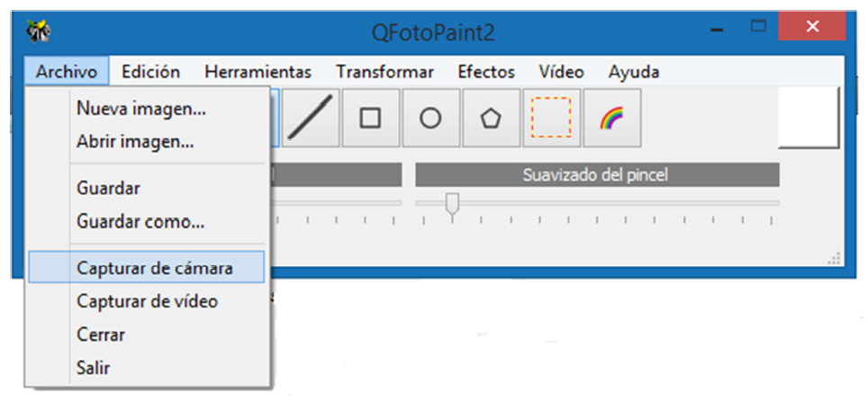

# qphotopaint

Desktop app that allows the input/output of images and video, being able to apply on them some of the main types of operations, filters and image processing provided by Paint (MS). This app has been developed using Qt Creator and OpenCV libraries.

## Features:

* The main menu includes the following opperations: File, Edit, Tools, Transform, Effects and Video.
* It is able to open several images simultaneously, being able to apply the operations on any of them.
* It accepts color images, and it supports the same formats as those recognized by OpenCV.

## Screenshots taking from the app:

### Capture from camera

To use this feature, click on the 'Capture from Camera' menu option available under "File Capture from Camera" --> "File Capture from Camera".

A pop-up window will then appear, displaying the video image being captured from the camera connected to the computer. The video playback has a default speed of 30 frames per second. Finally, when the user presses a key on the keyboard, a capture of the frame being played back on the computer will be made.

### Copy new

This feature allows copying the selected region of interest (ROI) to a new image. If the original image does not have a ROI selected, this option will copy the entire image.

